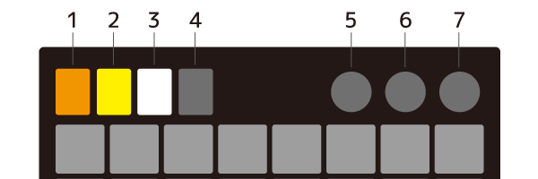
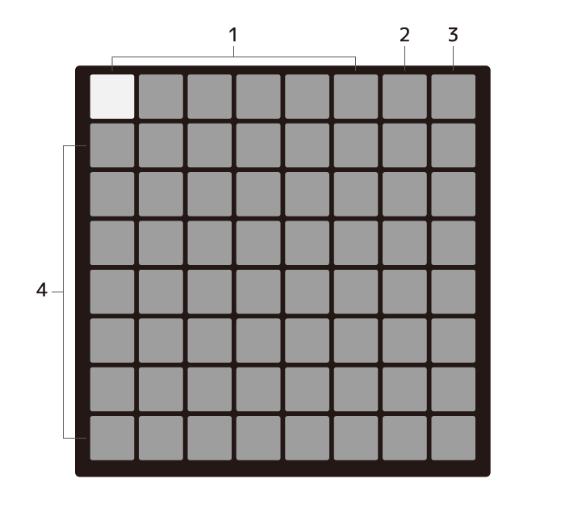
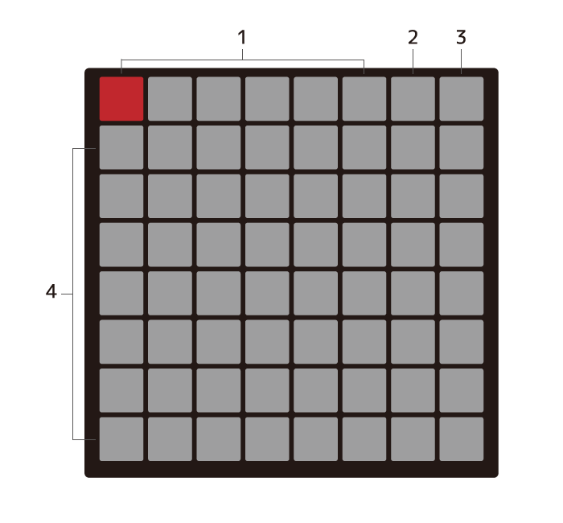
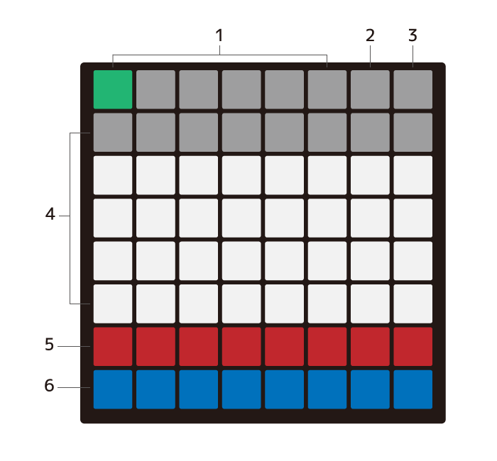
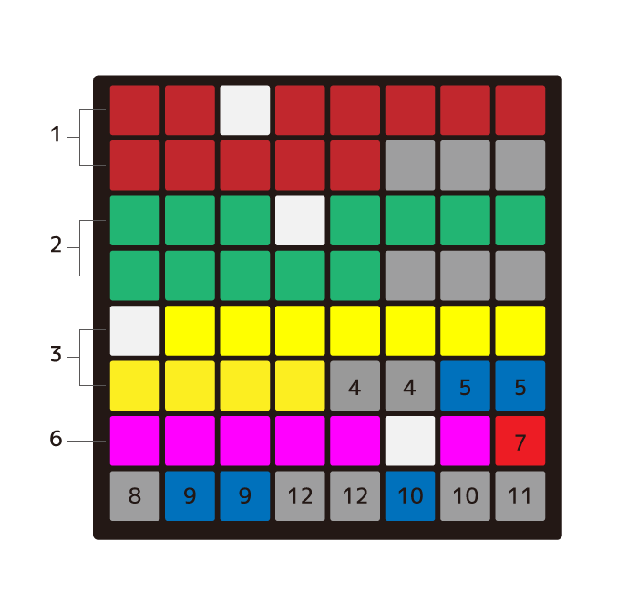

Feuille64 MIDI Firmware マニュアル
============================================================
## これはなに？
[◤◢◤◢◤◢◤◢](https://twitter.com/yynmt_)さんが開発した[Feuille64](https://booth.pm/ja/items/3148735)を単体でMIDIアルペジエータとして使用するためのファームウェアです

[Polygome](https://github.com/monome-community/polygome)を参考に、デバイス単体で動作するように実装しました。

## ファームウェア
- ソースコード   
https://github.com/hsgw/feuille64-midi

- コンパイル済みHEXファイル   
https://github.com/hsgw/feuille64-midi/tree/build

## 使い方

### グローバル

1. アルペジエータ演奏モードに入ります
2. アルペジエータステップ設定モードに入ります
3. アルペジエータパターン設定モードに入ります
4. 設定モードに入ります
5. 機能なし
6. 機能なし
7. 全てのノートをオフにします

**※ グローバルセクションは全てのモードで共通の操作です**

### アルペジエータ演奏モード

1. パターンを切り替えます(1-6)
2. アルペジエータのオンオフをトグルします   
アルペジエータをオフの場合、押しているキーに対応したノートをそのまま再生します   
通常のキーボードのように演奏できます
3. ホールドをトグルします   
ホールドが有効化のときは、押したキーをそのまま保持します。同じキーを再度押すか、ホールドを無効にすると保持を解除します
4. 押されたキーをルートとしてアルペジエータを開始します

### アルペジエータステップ設定モード

1. パターンを切り替えます
2. 機能なし 
3. 機能なし
4. ステップを設定します   
最初に押されたキーを基準にアルペジエータのステップを設定します   
ステップは8でループします

### アルペジエータパターン設定モード

パターン設定モードは列で1ステップとして各パラメータを設定します

1. パターンを切り替えます
2. 機能なし
3. 機能なし
4. ステップのベロシティを設定します
5. ステップのオンオフをトグルします
6. パターンの長さを設定します

### 設定モード

1. 行のスケールを設定します   
(OFF Chromatic M2 m3 M3 P4 Tritone P5   
 m6 M6 m7 M7 circle_of_5ths)
2. 列のスケールを設定します
3. キーのノートを設定します
4. キーのオクターブを1高くします
5. キーのオクターブを1低くします   
4-5は、オクターブを2進数で表示しています
6. ダイアトニックスケールへの変換時のモードを設定します
(ionian dorian phrigian lydian mixo-lydian eorian locrian)
7. ダイアトニックスケールへの変換をトグルします
8. 内部BPMを10増やします
9. 内部BPMを1増やします
10. 内部BPMを1減らします
11. 内部BPMを10減らします
12. MIDI clock syncを有効にします   
有効の場合はホストPCからのMIDIクロックと同期します(受信専用)   
無効の場合はデバイスの内部クロックに同期します 
6-12は、MIDI clock syncが有効の場合、赤色に点灯します。内部BPMが有効なら、2進数でBPMを表示します

